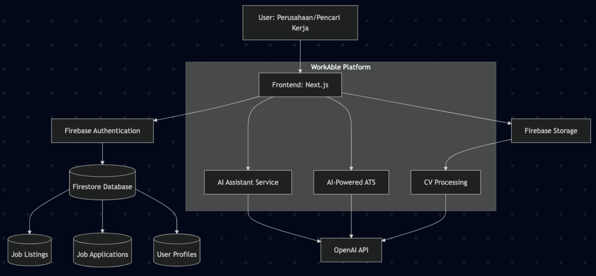

# WorkAble 🌟

## Project & Team Information

**Team**: TeeQobez

**Tagline**: Platform digital berbasis Natural Language Processing dan Computer Vision untuk meningkatkan akses kerja bagi penyandang disabilitas.

## 🚀 Deskripsi Singkat

Penyandang disabilitas di Indonesia menghadapi berbagai hambatan dalam mengakses dunia kerja, dengan partisipasi kerja formal yang sangat rendah (hanya 0,55% dari total tenaga kerja nasional). WorkAble hadir sebagai platform digital berbasis AI yang memanfaatkan teknologi Machine Learning, Natural Language Processing (NLP), dan Computer Vision untuk membantu penyandang disabilitas mendapatkan akses yang lebih mudah ke dunia kerja. Dengan pendekatan "Nothing about us without us", kami bertujuan mengubah paradigma dari charity-based menjadi empowerment-based, sehingga dapat meningkatkan produktivitas dan mendorong pertumbuhan ekonomi yang lebih inklusif dan berkelanjutan.

## 🎯 Fitur Utama

### 1. Sistem Pencocokan Otomatis

- Menggunakan NLP dan Machine Learning untuk mencocokkan keterampilan pengguna dengan deskripsi pekerjaan
- Rekomendasi pekerjaan berdasarkan keahlian dan preferensi pengguna

### 2. AI-Powered Applicant Tracking System (ATS)

- Analisis CV pelamar dengan AI
- Penilaian kesesuaian dengan persyaratan pekerjaan
- Rekomendasi pelamar terbaik untuk perusahaan

### 3. AI Asisten untuk Pencari Kerja

- Konsultasi karir berbasis AI
- Saran perbaikan CV
- Rekomendasi lowongan pekerjaan yang sesuai
- Bantuan umum terkait pekerjaan dan disabilitas

### 4. Platform Dua Sisi (Two-sided Platform)

- **Akun Perusahaan**: Membuka lowongan, mengelola pelamar, menggunakan ATS
- **Akun Pencari Kerja**: Mencari lowongan, melamar, berkonsultasi dengan AI Asisten

## 🧠 Tech Stack

### Frontend

- NextJS
- TypeScript
- Tailwind CSS
- Shadcn UI
- React Context API
- React Hook Form + Zod

### Backend & Services

- Firebase Authentication
- Firestore Database
- Firebase Storage
- Firebase Hosting

### AI

- OpenAI GPT APIs untuk analisis CV dan rekomendasi pekerjaan
- React Markdown untuk rendering konten AI

## 🏗️ Arsitektur / Diagram



## 🛠️ Cara Menjalankan

### Prasyarat

- Node.js 18+ dan npm
- Firebase project sudah dibuat

### Instalasi

```bash
# Mengkloning repositori
git clone https://github.com/yourusername/workable.git
cd workable

# Instalasi dependencies
npm install

# Menjalankan dalam mode development
npm run dev
```

### Konfigurasi Environment Variables

Buat file `.env.local` di root project dengan isi sebagai berikut:

```javascript
NEXT_PUBLIC_FIREBASE_API_KEY = your_api_key
NEXT_PUBLIC_FIREBASE_AUTH_DOMAIN = your_auth_domain
NEXT_PUBLIC_FIREBASE_PROJECT_ID = your_project_id
NEXT_PUBLIC_FIREBASE_STORAGE_BUCKET = your_storage_bucket
NEXT_PUBLIC_FIREBASE_MESSAGING_SENDER_ID = your_messaging_sender_id
NEXT_PUBLIC_FIREBASE_APP_ID = your_app_id
NEXT_PUBLIC_FIREBASE_MEASUREMENT_ID = your_measurement_id

NEXT_PUBLIC_OPENAI_API_KEY = your_openai_api_key
```

### Build untuk Production

```bash
npm run build
npm run start
```

## 📸 Link Video Demo

https://drive.google.com/drive/folders/1sC3id77DfDrz1RzP_vS_kEdY17tuEK28?usp=sharing
